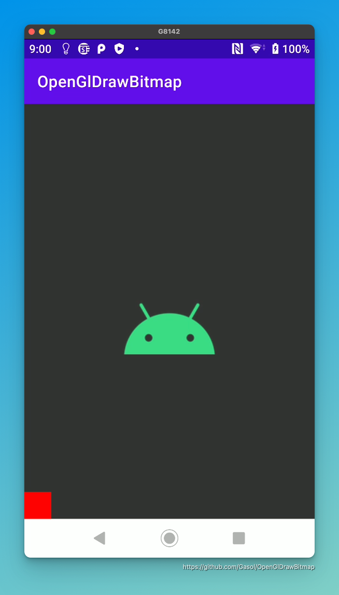

# Drawing Bitmap with OpenGL in Android

A simple Android application that loads bitmap into a texture and render it in
GLSurfaceView by using [grafika-gles](https://github.com/Gasol/grafika-gles).

